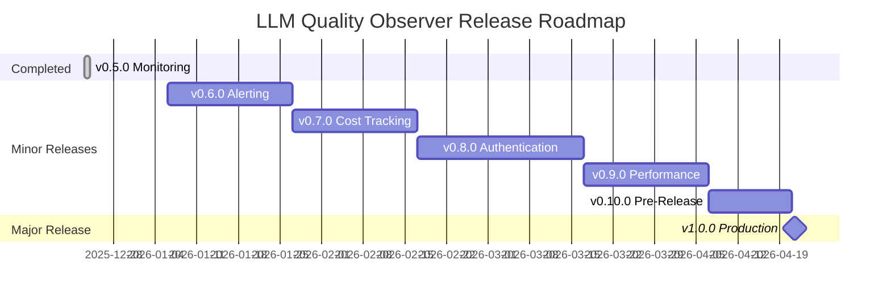

# LLM Quality Observer Roadmap

> **Current Version**: v0.6.0
>
> **Target Version**: v1.0.0 (Production-Ready)
>
> **Last Updated**: 2026-01-02

This document defines the development roadmap for LLM Quality Observer leading to v1.0.0.

---

## 📋 Versioning Policy

### Semantic Versioning

- **Major Release (v1.0.0)**: Breaking API changes, major architecture changes
- **Minor Release (v0.x.0)**: New features, backward compatible
- **Patch Release (v0.x.y)**: Bug fixes, documentation improvements, performance enhancements

### Release Cycle

- **Minor Releases**: Every 2-4 weeks
- **Patch Releases**: As needed (urgent bug fixes)
- **Major Release**: After all features stabilized (v1.0.0)

---

## 🔄 Patch Release Policy

Patch releases (v0.x.y) are deployed as needed without prior planning:

- **Urgent Bug Fixes**: Immediate patches for Critical/High severity bugs
- **Security Patches**: Priority deployment for security vulnerabilities
- **Documentation Fixes**: Corrections for critical documentation errors and omissions
- **Performance Hotfixes**: Fixes for severe performance degradation issues

Patch releases are documented in `CHANGELOG.md` and announced via GitHub Releases.

---

## 🚀 Minor Release Plans

### v0.6.0 - Alerting & Advanced Analytics ✅

**Release Date**: January 2, 2026
**Development Period**: Completed
**Theme**: Advanced alerting and analytics capabilities

#### Major Features

##### 1. Prometheus Alertmanager Integration ✅
- [x] Add Alertmanager container
- [x] Define Alert Rules (`infra/prometheus/alerts/`)
  - 42 rules (7 HTTP, 8 LLM, 12 Evaluation, 15 System)
  - High HTTP error rate (>5%)
  - Evaluation score drop (p50 < 3)
  - Scheduler failure detection
  - Pending logs spike (>1000)
- [x] Configure Alert Routing (Slack, Discord, Email)
- [x] Alert Grouping and Inhibition Rules
- [x] Alert Dashboard in Grafana (11 panels)

##### 2. Advanced Analytics ✅
- [x] Time-based quality trend analysis (hourly breakdown)
- [x] Model comparison dashboard (p50/p95/p99 latency)
- [x] Quality score distribution analysis (low/high quality count)
- [x] Error rate and success rate tracking

##### 3. API Improvements ✅
- [x] Add `/analytics/trends` endpoint
- [x] Add `/analytics/compare-models` endpoint
- [x] Add `/alerts/history` endpoint
- [x] Pagination support (page, page_size)

##### 4. Dashboard Improvements ✅
- [x] Add 2 new Grafana dashboards
  - Alert History Dashboard (11 panels)
  - Advanced Analytics Dashboard (11 panels)
- [x] Complete provisioning setup
- [x] Automatic dashboard loading

#### Technical Debt Resolution
- [ ] Migrate to SQLAlchemy 2.0 (deferred to v0.7.0)
- [ ] Achieve 50% test coverage (deferred to v0.7.0)
- [ ] Add integration tests to CI/CD (deferred to v0.7.0)

#### Release Notes
See [RELEASE_NOTES_v0.6.0.md](./release_notes/RELEASE_NOTES_v0.6.0.md)

---

### v0.7.0 - Cost Tracking & Multi-Model Support

**Expected Release**: Early February 2025
**Development Period**: 3 weeks
**Theme**: Cost management and multi-model support

#### Major Features

##### 1. Cost Tracking
- [ ] Record token usage
  - Separate request and response tokens
  - Configure model-specific token pricing
- [ ] Cost calculation logic
  - Real-time cost calculation
  - Per-user/per-model cost aggregation
- [ ] Cost metrics
  - `llm_gateway_token_usage_total`
  - `llm_gateway_cost_usd_total`
- [ ] Cost dashboard
  - Daily/weekly/monthly cost trends
  - Model cost comparison
  - Per-user cost analysis

##### 2. Enhanced Multi-Model Support
- [ ] Add model configuration table (`llm_models`)
- [ ] Dynamic model switching
- [ ] Fallback model configuration (on primary failure)
- [ ] Per-model availability monitoring
- [ ] Expand supported models
  - Anthropic Claude 3.5 Sonnet
  - Google Gemini 2.0 Flash
  - Meta Llama 3.3

##### 3. Evaluation Rule Engine Improvements
- [ ] Rule configuration UI (Streamlit)
- [ ] Custom rule add/edit functionality
- [ ] Rule priority settings
- [ ] Rule testing environment

##### 4. Database Improvements
- [ ] Partitioning strategy (monthly partitions for logs table)
- [ ] Archiving policy (data older than 90 days)
- [ ] Automated backup scripts

---

### v0.8.0 - Authentication & User Management

**Expected Release**: End of February 2025
**Development Period**: 3-4 weeks
**Theme**: Security and user management

#### Major Features

##### 1. Authentication/Authorization System
- [ ] JWT-based authentication
- [ ] API Key management
  - Issue/revoke per-user API keys
  - Key rotation functionality
  - Rate limiting per API key
- [ ] OAuth 2.0 support (optional)
  - Google, GitHub login
- [ ] Role-Based Access Control (RBAC)
  - Admin, Developer, Viewer roles

##### 2. User Management
- [ ] Add users table (`users`)
- [ ] User registration/login API
- [ ] User profile management
- [ ] Team/organization management (optional)

##### 3. Next.js Dashboard Authentication
- [ ] Implement login page
- [ ] Session management
- [ ] Protected routes
- [ ] Per-user data filtering

##### 4. Security Hardening
- [ ] Rate limiting (per IP, per user)
- [ ] Enhanced request validation
- [ ] SQL injection defense testing
- [ ] XSS defense testing
- [ ] Force HTTPS (production)

##### 5. Audit Logging
- [ ] User activity log table
- [ ] Record critical operations (evaluation runs, config changes)
- [ ] Audit log dashboard

---

### v0.9.0 - Performance & Scalability

**Expected Release**: Mid-March 2025
**Development Period**: 3 weeks
**Theme**: Performance optimization and scalability

#### Major Features

##### 1. Caching Layer
- [ ] Redis integration
  - Cache evaluation results (same prompt+response)
  - Session storage
  - Rate limiting counters
- [ ] Implement Cache-Aside pattern
- [ ] Configure cache expiration policies
- [ ] Cache hit rate metrics

##### 2. Asynchronous Processing Improvements
- [ ] Introduce Celery + RabbitMQ
  - Evaluation task queue
  - Notification task queue
  - Background job processing
- [ ] Task status monitoring
- [ ] Improved retry logic

##### 3. Database Optimization
- [ ] Optimize connection pooling
- [ ] Slow query logging and analysis
- [ ] Index optimization (EXPLAIN analysis)
- [ ] Read-only replica configuration (optional)

##### 4. API Performance Improvements
- [ ] Response compression (gzip)
- [ ] API response caching
- [ ] Add GraphQL endpoint (optional)
- [ ] Add batch API (multiple requests at once)

##### 5. Enhanced Monitoring
- [ ] OpenTelemetry integration
  - Distributed tracing
  - Span analysis
- [ ] Performance profiling tools
- [ ] Resource usage dashboard

##### 6. Load Testing
- [ ] Locust-based load test scripts
- [ ] Integrate performance tests into CI/CD
- [ ] Performance benchmark documentation

---

### v0.10.0 - Production Hardening (Pre-Release)

**Expected Release**: End of March 2025
**Development Period**: 2 weeks
**Theme**: Production deployment preparation

#### Major Tasks

##### 1. Deployment Automation
- [ ] Kubernetes manifests (`infra/k8s/`)
  - Deployment, Service, Ingress
  - ConfigMap, Secret management
  - HPA (Horizontal Pod Autoscaler)
- [ ] Write Helm charts
- [ ] Terraform scripts (AWS/GCP/Azure)
- [ ] Improve CI/CD pipeline
  - Auto-deploy to staging
  - Production deployment approval process

##### 2. High Availability
- [ ] Improve service health checks
- [ ] Implement graceful shutdown
- [ ] Circuit breaker pattern
- [ ] Database failover configuration

##### 3. Disaster Recovery
- [ ] Automated backup scripts
- [ ] Backup restoration testing
- [ ] Document RTO/RPO

##### 4. Complete Documentation
- [ ] Auto-generate API reference (OpenAPI 3.0)
- [ ] Operations guide (`docs/OPERATIONS.md`)
- [ ] Architecture Decision Records (ADR)
- [ ] Security guide (`docs/SECURITY.md`)

##### 5. Final Testing
- [ ] Write end-to-end tests
- [ ] Security vulnerability scanning (Snyk, Trivy)
- [ ] Performance regression testing
- [ ] User acceptance testing (UAT)

---

## 🎯 v1.0.0 - Production Release

**Expected Release**: Early April 2025
**Theme**: Stable production deployment

### Release Criteria (Definition of Done)

#### Feature Completeness
- ✅ All core features implemented
- ✅ All documentation completed
- ✅ API version stabilized (v1 API)

#### Quality Standards
- ✅ Test coverage >80%
- ✅ Zero known Critical/High bugs
- ✅ Performance benchmarks passed
  - HTTP p95 < 1s
  - LLM p95 < 3s (excluding model response time)
- ✅ Security vulnerability scan passed

#### Operational Readiness
- ✅ Production environment configured
- ✅ Monitoring and alerting configured
- ✅ Backup and recovery process verified
- ✅ Load testing passed (1000 RPS)

#### Documentation
- ✅ User guide completed
- ✅ Developer guide completed
- ✅ Operations guide completed
- ✅ API reference completed

### v1.0.0 Key Features

- **Stable API**: Backward compatibility guaranteed, clear versioning
- **Production-Ready**: High availability, scalability, security hardened
- **Complete Documentation**: Detailed guides for all features
- **Enterprise Support**: Authentication, authorization, audit logging
- **Performance Optimized**: Caching, async processing, database optimization
- **Full Monitoring**: Prometheus, Grafana, Alertmanager, tracing

---

## 📊 Roadmap Visualization

---

## 🔍 Priority by Version

### High Priority (Must Have)
- **v0.6.0**: Alertmanager, advanced analytics
- **v0.7.0**: Cost tracking, multi-model
- **v0.8.0**: Authentication/authorization
- **v0.9.0**: Performance optimization
- **v1.0.0**: Production deployment

### Medium Priority (Should Have)
- **v0.6.0**: Alert dashboard
- **v0.7.0**: Rule engine UI
- **v0.8.0**: OAuth login
- **v0.9.0**: GraphQL API

### Low Priority (Nice to Have)
- **v0.7.0**: Data archiving
- **v0.8.0**: Team/organization management
- **v0.9.0**: Read-only replicas

---

## 🚧 Risks and Mitigation

### Risk 1: Scope Creep
- **Mitigation**: Classify each version's features as Must/Should/Nice, implement Must only
- **Review**: Reprioritize at the beginning of each sprint

### Risk 2: Technical Debt Accumulation
- **Mitigation**: Allocate 20% time for technical debt resolution in each minor release
- **Review**: Document technical debt items during code review

### Risk 3: External Dependency Issues
- **Mitigation**: Auto-switch to fallback model on OpenAI API failure
- **Review**: Monitor third-party service health checks

### Risk 4: Performance Degradation
- **Mitigation**: Integrate performance regression tests into CI/CD
- **Review**: Run load tests before each release

---

## 📝 Release Checklist Template

Verify these items for each release:

### Development Phase
- [ ] All planned features implemented
- [ ] Unit tests written and passing
- [ ] Integration tests written and passing
- [ ] Code review completed
- [ ] Technical debt items documented

### Testing Phase
- [ ] Local environment testing
- [ ] Docker environment testing
- [ ] CI/CD pipeline passing
- [ ] Performance testing executed (v0.9.0+)
- [ ] Security scanning executed (v0.8.0+)

### Documentation Phase
- [ ] CHANGELOG.md updated
- [ ] README.md updated
- [ ] Release notes written
- [ ] API documentation updated
- [ ] Migration guide written (if needed)

### Deployment Phase
- [ ] Git tag created
- [ ] GitHub release created
- [ ] Docker images built and tagged
- [ ] Deployment script executed (production)
- [ ] Health checks verified
- [ ] Monitoring dashboard verified

### Post-Release
- [ ] Release announcement (Slack, Discord)
- [ ] Community feedback collected
- [ ] Bug report monitoring
- [ ] Next version planning

---

## 🎓 References

- [Semantic Versioning 2.0.0](https://semver.org/)
- [Keep a Changelog](https://keepachangelog.com/)
- [Conventional Commits](https://www.conventionalcommits.org/)

---

## 📞 Feedback and Suggestions

Submit feedback on the roadmap through:

- GitHub Issues: Feature requests, bug reports
- GitHub Discussions: Roadmap discussion, priority suggestions
- Pull Requests: Roadmap document improvements

---

**Last Updated**: 2025-12-26

**Next Review**: After v0.6.0 release
