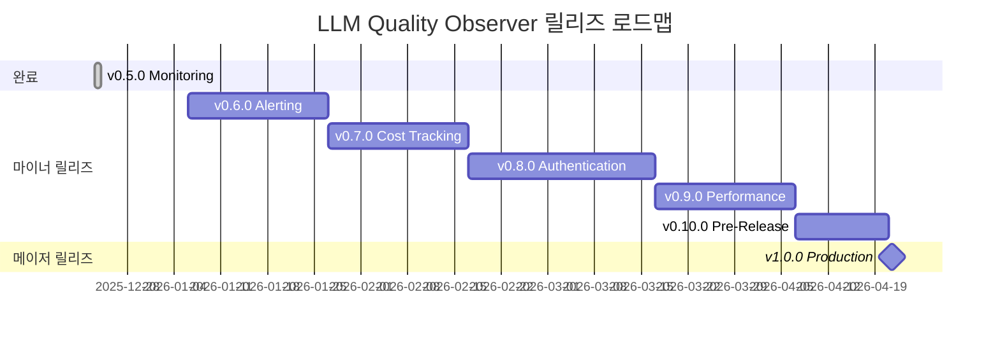

# LLM Quality Observer 로드맵

> **현재 버전**: v0.5.0
> 
> **목표 버전**: v1.0.0 (Production-Ready)
> 
> **마지막 업데이트**: 2025-12-26

이 문서는 LLM Quality Observer의 v1.0.0까지의 개발 로드맵을 정의합니다.

---

## 📋 버전 관리 정책

### 시맨틱 버저닝 (Semantic Versioning)

- **메이저 릴리즈 (v1.0.0)**: API 호환성이 깨지는 변경, 주요 아키텍처 변경
- **마이너 릴리즈 (v0.x.0)**: 새로운 기능 추가, 하위 호환성 유지
- **패치 릴리즈 (v0.x.y)**: 버그 수정, 문서 개선, 성능 개선

### 릴리즈 주기

- **마이너 릴리즈**: 2-4주 간격
- **패치 릴리즈**: 필요 시 수시 배포 (긴급 버그 수정)
- **메이저 릴리즈**: 모든 기능 안정화 후 (v1.0.0)

---

## 🔄 패치 릴리즈 정책

패치 릴리즈(v0.x.y)는 사전 계획 없이 필요 시 즉시 배포합니다:

- **긴급 버그 수정**: Critical/High 등급 버그 발견 시 즉시 패치
- **보안 패치**: 보안 취약점 발견 시 우선 배포
- **문서 오류 수정**: 중요한 문서 오류 및 누락 사항
- **성능 핫픽스**: 심각한 성능 저하 문제

패치 릴리즈는 `CHANGELOG.md`에 기록되며, GitHub Release를 통해 공지됩니다.

---

## 🚀 마이너 릴리즈 계획

### v0.6.0 - Alerting & Advanced Analytics

**예상 릴리즈**: 2025년 1월 중순
**개발 기간**: 2-3주
**테마**: 알림 고도화 및 분석 기능 강화

#### 주요 기능

##### 1. Prometheus Alertmanager 통합
- [ ] Alertmanager 컨테이너 추가
- [ ] Alert Rules 정의 (`infra/prometheus/alerts/`)
  - 높은 HTTP 에러율 (>5%)
  - 평가 점수 급락 (p50 < 3)
  - 스케줄러 중단 감지
  - Pending Logs 급증 (>100)
- [ ] Alert Routing 설정 (Slack, Discord, Email)
- [ ] Alert Silence/Mute 기능
- [ ] Alert Dashboard in Grafana

##### 2. 고급 분석 기능
- [ ] 시간대별 품질 트렌드 분석
- [ ] 사용자별 품질 메트릭 집계
- [ ] 모델 간 비교 분석 대시보드
- [ ] 프롬프트 패턴 분석 (자주 실패하는 프롬프트 유형)

##### 3. API 개선
- [ ] `/analytics/trends` 엔드포인트 추가
- [ ] `/analytics/compare-models` 엔드포인트 추가
- [ ] `/alerts/history` 엔드포인트 추가
- [ ] 페이지네이션 지원 (limit, offset)

##### 4. 대시보드 개선
- [ ] Grafana 대시보드 2개 추가
  - Alert History Dashboard
  - Advanced Analytics Dashboard
- [ ] Streamlit 대시보드 개선
  - 시계열 분석 페이지 추가
  - 모델 비교 페이지 추가

#### 기술 부채 해결
- [ ] SQLAlchemy 2.0 마이그레이션
- [ ] 테스트 커버리지 50% 달성
- [ ] CI/CD에 통합 테스트 추가

---

### v0.7.0 - Cost Tracking & Multi-Model Support

**예상 릴리즈**: 2025년 2월 초
**개발 기간**: 3주
**테마**: 비용 관리 및 다중 모델 지원

#### 주요 기능

##### 1. 비용 추적 (Cost Tracking)
- [ ] 토큰 사용량 기록
  - 요청 토큰, 응답 토큰 분리
  - 모델별 토큰 단가 설정
- [ ] 비용 계산 로직
  - 실시간 비용 계산
  - 사용자별/모델별 비용 집계
- [ ] 비용 메트릭
  - `llm_gateway_token_usage_total`
  - `llm_gateway_cost_usd_total`
- [ ] 비용 대시보드
  - 일/주/월별 비용 추이
  - 모델별 비용 비교
  - 사용자별 비용 분석

##### 2. 다중 모델 지원 확장
- [ ] 모델 설정 테이블 추가 (`llm_models`)
- [ ] 모델 동적 전환 기능
- [ ] Fallback 모델 설정 (primary 실패 시)
- [ ] 모델별 가용성 모니터링
- [ ] 지원 모델 확장
  - Anthropic Claude 3.5 Sonnet
  - Google Gemini 2.0 Flash
  - Meta Llama 3.3

##### 3. 평가 규칙 엔진 개선
- [ ] 규칙 설정 UI (Streamlit)
- [ ] 커스텀 규칙 추가/편집 기능
- [ ] 규칙 우선순위 설정
- [ ] 규칙 테스트 환경

##### 4. 데이터베이스 개선
- [ ] 파티셔닝 전략 (logs 테이블 월별 파티션)
- [ ] 아카이빙 정책 (90일 이상 데이터)
- [ ] 백업 자동화 스크립트

---

### v0.8.0 - Authentication & User Management

**예상 릴리즈**: 2025년 2월 말
**개발 기간**: 3-4주
**테마**: 보안 및 사용자 관리

#### 주요 기능

##### 1. 인증/인가 시스템
- [ ] JWT 기반 인증
- [ ] API Key 관리
  - 사용자별 API Key 발급/폐기
  - Key rotation 기능
  - Rate limiting per API Key
- [ ] OAuth 2.0 지원 (선택적)
  - Google, GitHub 로그인
- [ ] 권한 관리 (RBAC)
  - Admin, Developer, Viewer 역할

##### 2. 사용자 관리
- [ ] 사용자 테이블 추가 (`users`)
- [ ] 사용자 등록/로그인 API
- [ ] 사용자 프로필 관리
- [ ] 팀/조직 관리 (선택적)

##### 3. Next.js Dashboard 인증
- [ ] 로그인 페이지 구현
- [ ] 세션 관리
- [ ] Protected Routes
- [ ] 사용자별 데이터 필터링

##### 4. 보안 강화
- [ ] Rate Limiting (per IP, per User)
- [ ] Request Validation 강화
- [ ] SQL Injection 방어 테스트
- [ ] XSS 방어 테스트
- [ ] HTTPS 강제 (프로덕션)

##### 5. 감사 로그 (Audit Log)
- [ ] 사용자 활동 로그 테이블
- [ ] 중요 작업 기록 (평가 실행, 설정 변경)
- [ ] 감사 로그 대시보드

---

### v0.9.0 - Performance & Scalability

**예상 릴리즈**: 2025년 3월 중순
**개발 기간**: 3주
**테마**: 성능 최적화 및 확장성

#### 주요 기능

##### 1. 캐싱 레이어
- [ ] Redis 통합
  - 평가 결과 캐싱 (동일 프롬프트+응답)
  - 세션 저장
  - Rate limiting 카운터
- [ ] Cache-Aside 패턴 구현
- [ ] 캐시 만료 정책 설정
- [ ] 캐시 히트율 메트릭

##### 2. 비동기 처리 개선
- [ ] Celery + RabbitMQ 도입
  - 평가 작업 큐
  - 알림 작업 큐
  - 백그라운드 작업 처리
- [ ] 작업 상태 모니터링
- [ ] 재시도 로직 개선

##### 3. 데이터베이스 최적화
- [ ] Connection Pooling 최적화
- [ ] 슬로우 쿼리 로깅 및 분석
- [ ] 인덱스 최적화 (EXPLAIN 분석)
- [ ] 읽기 전용 복제본 구성 (선택적)

##### 4. API 성능 개선
- [ ] 응답 압축 (gzip)
- [ ] API 응답 캐싱
- [ ] GraphQL 엔드포인트 추가 (선택적)
- [ ] Batch API 추가 (여러 요청 한 번에)

##### 5. 모니터링 강화
- [ ] OpenTelemetry 통합
  - Distributed Tracing
  - Span 분석
- [ ] 성능 프로파일링 도구
- [ ] Resource Usage Dashboard

##### 6. 부하 테스트
- [ ] Locust 기반 부하 테스트 스크립트
- [ ] CI/CD에 성능 테스트 통합
- [ ] 성능 벤치마크 문서

---

### v0.10.0 - Production Hardening (Pre-Release)

**예상 릴리즈**: 2025년 3월 말
**개발 기간**: 2주
**테마**: 프로덕션 배포 준비

#### 주요 작업

##### 1. 배포 자동화
- [ ] Kubernetes 매니페스트 (`infra/k8s/`)
  - Deployment, Service, Ingress
  - ConfigMap, Secret 관리
  - HPA (Horizontal Pod Autoscaler)
- [ ] Helm Chart 작성
- [ ] Terraform 스크립트 (AWS/GCP/Azure)
- [ ] CI/CD 파이프라인 개선
  - Staging 환경 자동 배포
  - Production 배포 승인 프로세스

##### 2. 고가용성 (High Availability)
- [ ] 서비스 헬스체크 개선
- [ ] Graceful Shutdown 구현
- [ ] Circuit Breaker 패턴
- [ ] 데이터베이스 Failover 설정

##### 3. 재해 복구 (Disaster Recovery)
- [ ] 자동 백업 스크립트
- [ ] 백업 복원 테스트
- [ ] RTO/RPO 문서화

##### 4. 문서 완성
- [ ] API Reference 자동 생성 (OpenAPI 3.0)
- [ ] 운영 가이드 (`docs/OPERATIONS.md`)
- [ ] 아키텍처 결정 기록 (ADR)
- [ ] 보안 가이드 (`docs/SECURITY.md`)

##### 5. 최종 테스트
- [ ] End-to-End 테스트 작성
- [ ] 보안 취약점 스캔 (Snyk, Trivy)
- [ ] 성능 회귀 테스트
- [ ] 사용자 인수 테스트 (UAT)

---

## 🎯 v1.0.0 - Production Release

**예상 릴리즈**: 2025년 4월 초
**테마**: 안정적인 프로덕션 배포

### 릴리즈 기준 (Definition of Done)

#### 기능 완성도
- ✅ 모든 핵심 기능 구현 완료
- ✅ 모든 문서화 완료
- ✅ API 버전 안정화 (v1 API)

#### 품질 기준
- ✅ 테스트 커버리지 >80%
- ✅ 알려진 Critical/High 버그 0건
- ✅ 성능 벤치마크 통과
  - HTTP p95 < 1초
  - LLM p95 < 3초 (모델 응답 시간 제외)
- ✅ 보안 취약점 스캔 통과

#### 운영 준비도
- ✅ 프로덕션 환경 구성 완료
- ✅ 모니터링 및 알림 설정 완료
- ✅ 백업 및 복구 프로세스 검증
- ✅ 부하 테스트 통과 (1000 RPS)

#### 문서화
- ✅ 사용자 가이드 완성
- ✅ 개발자 가이드 완성
- ✅ 운영 가이드 완성
- ✅ API 레퍼런스 완성

### v1.0.0 주요 특징

- **안정적인 API**: 하위 호환성 보장, 명확한 버전 관리
- **프로덕션 준비**: 고가용성, 확장성, 보안 강화
- **완전한 문서화**: 모든 기능에 대한 상세한 가이드
- **엔터프라이즈 지원**: 인증, 권한 관리, 감사 로그
- **성능 최적화**: 캐싱, 비동기 처리, 데이터베이스 최적화
- **모니터링 완비**: Prometheus, Grafana, Alertmanager, Tracing

---

## 📊 로드맵 시각화

---

## 🔍 버전별 우선순위

### 높은 우선순위 (Must Have)
- **v0.6.0**: Alertmanager, 고급 분석
- **v0.7.0**: 비용 추적, 다중 모델
- **v0.8.0**: 인증/인가
- **v0.9.0**: 성능 최적화
- **v1.0.0**: 프로덕션 배포

### 중간 우선순위 (Should Have)
- **v0.6.0**: Alert Dashboard
- **v0.7.0**: 규칙 엔진 UI
- **v0.8.0**: OAuth 로그인
- **v0.9.0**: GraphQL API

### 낮은 우선순위 (Nice to Have)
- **v0.7.0**: 데이터 아카이빙
- **v0.8.0**: 팀/조직 관리
- **v0.9.0**: 읽기 전용 복제본

---

## 🚧 위험 요소 및 대응 방안

### 위험 1: 범위 확대 (Scope Creep)
- **대응**: 각 버전 기능을 Must/Should/Nice로 분류, Must만 필수 구현
- **검토**: 매 스프린트 초 우선순위 재확인

### 위험 2: 기술 부채 누적
- **대응**: 각 마이너 릴리즈마다 기술 부채 해결 시간 20% 할당
- **검토**: 코드 리뷰 시 기술 부채 항목 문서화

### 위험 3: 외부 의존성 문제
- **대응**: OpenAI API 장애 시 Fallback 모델 자동 전환
- **검토**: 써드파티 서비스 헬스체크 모니터링

### 위험 4: 성능 저하
- **대응**: CI/CD에 성능 회귀 테스트 통합
- **검토**: 매 릴리즈 전 부하 테스트 실행

---

## 📝 릴리즈 체크리스트 템플릿

각 릴리즈 시 다음 항목 확인:

### 개발 단계
- [ ] 모든 계획된 기능 구현 완료
- [ ] 단위 테스트 작성 및 통과
- [ ] 통합 테스트 작성 및 통과
- [ ] 코드 리뷰 완료
- [ ] 기술 부채 항목 문서화

### 테스트 단계
- [ ] 로컬 환경 테스트
- [ ] Docker 환경 테스트
- [ ] CI/CD 파이프라인 통과
- [ ] 성능 테스트 실행 (v0.9.0+)
- [ ] 보안 스캔 실행 (v0.8.0+)

### 문서화 단계
- [ ] CHANGELOG.md 업데이트
- [ ] README.md 업데이트
- [ ] 릴리즈 노트 작성
- [ ] API 문서 업데이트
- [ ] 마이그레이션 가이드 작성 (필요 시)

### 배포 단계
- [ ] Git 태그 생성
- [ ] GitHub Release 생성
- [ ] Docker 이미지 빌드 및 태그
- [ ] 배포 스크립트 실행 (프로덕션)
- [ ] 헬스체크 확인
- [ ] 모니터링 대시보드 확인

### 사후 조치
- [ ] 릴리즈 공지 (Slack, Discord)
- [ ] 커뮤니티 피드백 수집
- [ ] 버그 리포트 모니터링
- [ ] 다음 버전 계획 수립

---

## 🎓 참고 자료

- [시맨틱 버저닝 2.0.0](https://semver.org/lang/ko/)
- [Keep a Changelog](https://keepachangelog.com/ko/)
- [Conventional Commits](https://www.conventionalcommits.org/ko/)

---

## 📞 피드백 및 제안

로드맵에 대한 피드백은 다음 채널로 제출해주세요:

- GitHub Issues: 기능 요청, 버그 리포트
- GitHub Discussions: 로드맵 토론, 우선순위 제안
- Pull Requests: 로드맵 문서 개선

---

**마지막 업데이트**: 2025-12-26

**다음 검토 예정**: v0.6.0 릴리즈 후
