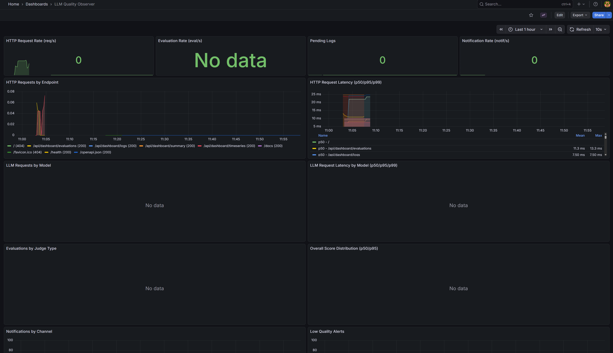

# Grafana 대시보드 가이드

  ## LLM Quality Observer Grafana Dashboard Overview

  

LLM Quality Observer Grafana 대시보드는 시스템의 성능, 품질 메트릭, 알림 현황을 실시간으로 모니터링할 수 있는 14개의 시각화 패널로 구성되어 있습니다.

**대시보드 접속:**
- URL: http://localhost:3001
- 기본 로그인: admin / admin
- 경로: Dashboards → LLM Quality Observer

---

## 대시보드 구조

### 1️⃣ Overview Stats (개요 통계)

상단의 4개 통계 패널은 시스템의 현재 상태를 한눈에 보여줍니다.

#### HTTP Request Rate (req/s)
- **목적**: Gateway API로 들어오는 HTTP 요청의 초당 비율
- **PromQL**: `sum(rate(llm_gateway_http_requests_total[5m]))`
- **의미**:
  - 시스템에 얼마나 많은 트래픽이 들어오는지 확인
  - 최근 5분간의 평균 요청 비율 계산
- **정상값**: 사용 패턴에 따라 다름 (테스트 환경에서는 낮음)
- **No Data 원인**: Gateway API로 요청이 아직 없음
- **해결**: `/chat` 엔드포인트로 테스트 요청 전송

```bash
curl -X POST "http://localhost:18000/chat" \
  -H "Content-Type: application/json" \
  -d '{"prompt": "Hello", "user_id": "test"}'
```

#### Evaluation Rate (eval/s)
- **목적**: Evaluator 서비스가 수행하는 초당 평가 비율
- **PromQL**: `sum(rate(llm_evaluator_evaluations_total[5m]))`
- **의미**:
  - 얼마나 빠르게 로그를 평가하고 있는지 측정
  - 배치 평가 스케줄러와 수동 평가 모두 포함
- **정상값**: 스케줄러 설정에 따라 다름
- **No Data 원인**: 평가가 아직 실행되지 않음
- **해결**: 평가 수동 실행

```bash
curl -X POST "http://localhost:18001/evaluate-once?limit=5"
```

#### Pending Logs
- **목적**: 아직 평가되지 않은 로그의 개수
- **PromQL**: `llm_evaluator_pending_logs`
- **의미**:
  - 평가 대기 중인 로그 수 (Gauge 메트릭)
  - 값이 계속 증가하면 평가 속도가 느린 것
- **정상값**:
  - 0에 가까운 값 (모든 로그가 평가됨)
  - 스케줄러가 활성화되어 있으면 주기적으로 감소
- **No Data 원인**: Evaluator 서비스가 메트릭을 아직 업데이트하지 않음
- **해결**: 평가를 한 번 실행하면 메트릭이 생성됨

#### Notification Rate (notif/s)
- **목적**: 초당 전송되는 알림 비율 (Slack, Discord, Email)
- **PromQL**: `sum(rate(llm_evaluator_notifications_sent_total[5m]))`
- **의미**:
  - 품질 문제나 배치 완료 알림이 얼마나 자주 발생하는지
  - 채널별로 분리되지 않은 전체 알림 수
- **정상값**: 낮은 품질 로그가 있을 때만 증가
- **No Data 원인**:
  - 알림이 전송된 적 없음
  - `NOTIFICATION_SCORE_THRESHOLD` 이하의 점수가 없음
- **해결**: 낮은 품질 응답을 생성하여 알림 트리거

---

### 2️⃣ HTTP & LLM Performance (성능 메트릭)

API 응답 성능과 LLM 호출 지연시간을 모니터링합니다.

#### HTTP Requests by Endpoint
- **목적**: 엔드포인트별 요청 분포 시계열 그래프
- **PromQL**: `sum(rate(llm_gateway_http_requests_total[5m])) by (endpoint)`
- **의미**:
  - 어떤 엔드포인트가 가장 많이 사용되는지 확인
  - `/chat`, `/health`, `/metrics` 등으로 구분
- **시각화**: 시간에 따른 라인 차트
- **활용**:
  - 특정 엔드포인트의 트래픽 증가 감지
  - 비정상적인 엔드포인트 호출 패턴 확인

#### HTTP Request Latency (p50/p95/p99)
- **목적**: HTTP 요청의 응답 시간 백분위수
- **PromQL**:
  ```promql
  histogram_quantile(0.50, sum(rate(llm_gateway_http_request_duration_seconds_bucket[5m])) by (le))  # p50
  histogram_quantile(0.95, sum(rate(llm_gateway_http_request_duration_seconds_bucket[5m])) by (le))  # p95
  histogram_quantile(0.99, sum(rate(llm_gateway_http_request_duration_seconds_bucket[5m])) by (le))  # p99
  ```
- **의미**:
  - **p50 (중앙값)**: 50%의 요청이 이 시간 이내에 완료
  - **p95**: 95%의 요청이 이 시간 이내에 완료
  - **p99**: 99%의 요청이 이 시간 이내에 완료
- **정상값**:
  - p50: 1-2초 (LLM 응답 시간 포함)
  - p95: 3-5초
  - p99: 5-10초
- **경고**: p99가 10초 이상이면 성능 문제 가능성
- **No Data 원인**: 히스토그램 버킷에 데이터가 충분하지 않음

#### LLM Requests by Model
- **목적**: 모델별 LLM API 호출 비율
- **PromQL**: `sum(rate(llm_gateway_llm_requests_total[5m])) by (model)`
- **의미**:
  - 어떤 LLM 모델이 가장 많이 사용되는지 확인
  - `gpt-5-mini`, `gpt-4o-mini` 등으로 구분
- **활용**:
  - 모델별 사용량 추적
  - 비용 최적화를 위한 모델 선택 분석

#### LLM Request Latency by Model (p50/p95/p99)
- **목적**: 모델별 LLM API 호출 지연시간 백분위수
- **PromQL**:
  ```promql
  histogram_quantile(0.50, sum(rate(llm_gateway_llm_request_duration_seconds_bucket[5m])) by (le, model))
  ```
- **의미**:
  - 각 LLM 모델의 응답 속도 비교
  - 모델 간 성능 차이 확인
- **활용**:
  - 느린 모델 식별
  - SLA 준수 여부 모니터링
- **참고**:
  - gpt-5-mini는 일반적으로 gpt-4보다 빠름
  - Judge 모델(gpt-4o-mini)은 별도로 추적되지 않음 (Evaluator 서비스)

---

### 3️⃣ Quality & Notifications (품질 및 알림)

LLM 응답 품질과 알림 전송 현황을 추적합니다.

#### Evaluations by Judge Type
- **목적**: 평가 방식별 평가 실행 비율
- **PromQL**: `sum(rate(llm_evaluator_evaluations_total[5m])) by (judge_type)`
- **의미**:
  - `rule` (규칙 기반) vs `llm` (LLM-as-a-Judge) 비율
  - 어떤 평가 방식이 더 많이 사용되는지 확인
- **설정**: `.env.local`의 `EVALUATION_JUDGE_TYPE`로 제어
  - `rule`: 빠르고 저렴, 단순한 규칙 적용
  - `llm`: 느리고 비용 발생, 복잡한 품질 평가
- **활용**: 비용과 정확도의 균형 분석

#### Overall Score Distribution (p50/p95)
- **목적**: 평가 점수의 중앙값과 95번째 백분위수
- **PromQL**:
  ```promql
  histogram_quantile(0.50, sum(rate(llm_evaluator_evaluation_scores_bucket{score_type="overall"}[5m])) by (le))  # p50
  histogram_quantile(0.95, sum(rate(llm_evaluator_evaluation_scores_bucket{score_type="overall"}[5m])) by (le))  # p95
  ```
- **의미**:
  - **p50**: 평가 점수의 중앙값 (대부분의 응답 품질)
  - **p95**: 상위 95%의 점수 (우수한 응답의 기준)
- **점수 범위**: 1-5점
  - 1-2점: Critical (심각한 품질 문제)
  - 3점: Warning (개선 필요)
  - 4-5점: Good (양호)
- **목표**: p50이 4점 이상 유지
- **No Data 원인**:
  - 평가 점수가 히스토그램으로 기록되지 않음
  - 평가 횟수가 충분하지 않음

#### Notifications by Channel
- **목적**: 채널별 알림 전송 성공률 시계열
- **PromQL**: `sum(rate(llm_evaluator_notifications_sent_total[5m])) by (channel, status)`
- **의미**:
  - Slack, Discord, Email 각각의 전송 성공/실패 추적
  - 알림 인프라의 건강성 확인
- **채널**:
  - `slack`: Slack 웹훅
  - `discord`: Discord 웹훅
  - `email`: SMTP 이메일
- **상태**:
  - `success`: 전송 성공
  - `error`: 전송 실패
- **경고**: 특정 채널의 error rate가 높으면 설정 확인 필요

#### Low Quality Alerts
- **목적**: 낮은 품질 경고 발생 빈도
- **PromQL**: `sum(rate(llm_evaluator_low_quality_alerts_total[5m])) by (judge_type)`
- **의미**:
  - `NOTIFICATION_SCORE_THRESHOLD` 이하의 점수가 얼마나 자주 발생하는지
  - 품질 문제의 심각성 모니터링
- **목표**: 값이 낮을수록 좋음
- **활용**:
  - 품질 저하 추세 조기 감지
  - 프롬프트나 모델 변경 후 효과 측정
- **No Data 원인**: 낮은 품질 응답이 없음 (좋은 신호!)

---

### 4️⃣ System Health (시스템 상태)

스케줄러와 배치 평가 시스템의 작동 상태를 확인합니다.

#### Scheduler Runs
- **목적**: 자동 평가 스케줄러 실행 비율
- **PromQL**: `sum(rate(llm_evaluator_scheduler_runs_total[5m]))`
- **의미**:
  - 스케줄러가 정상적으로 작동하는지 확인
  - 설정된 간격마다 실행되는지 모니터링
- **설정**: `.env.local`의 `EVALUATION_INTERVAL_MINUTES`
  - 기본값: 60분 (1시간마다 실행)
- **정상값**:
  - 60분 간격이면 시간당 1회 = 0.000277 runs/s
  - 그래프가 계단식으로 증가
- **경고**: 값이 증가하지 않으면 스케줄러 중단
- **확인**:
  ```bash
  docker logs llm-evaluator | grep "Scheduler"
  ```

#### Batch Evaluation - Logs Processed
- **목적**: 배치 평가로 처리된 로그 수 누적
- **PromQL**: `sum(llm_evaluator_batch_logs_processed_total)`
- **의미**:
  - 스케줄러가 총 몇 개의 로그를 평가했는지 추적
  - 시스템의 처리량 확인
- **시각화**: 누적 그래프 (계속 증가)
- **설정**: `.env.local`의 `EVALUATION_BATCH_SIZE`
  - 기본값: 10 (한 번에 10개씩 처리)
- **활용**:
  - 배치 크기 최적화
  - 처리 속도 추세 분석

---

## No Data 문제 해결

대시보드에서 "No Data"가 표시되는 경우 아래 단계를 따르세요:

### 1. Prometheus 타겟 확인

```bash
# Prometheus UI에서 타겟 상태 확인
http://localhost:9090/targets

# 또는 API로 확인
curl http://localhost:9090/api/v1/targets | jq '.data.activeTargets[] | {job: .labels.job, health: .health}'
```

**기대 결과:**
- `gateway-api`: health = "up"
- `evaluator`: health = "up"

### 2. 메트릭 엔드포인트 확인

```bash
# Gateway API 메트릭 확인
curl http://localhost:18000/metrics | grep llm_gateway

# Evaluator 메트릭 확인
curl http://localhost:18001/metrics | grep llm_evaluator
```

메트릭이 보이지 않으면 서비스 재시작:
```bash
docker compose -f docker-compose.local.yml restart gateway-api evaluator
```

### 3. 데이터 생성

일부 메트릭은 활동이 있어야 데이터가 생성됩니다:

```bash
# 1. Gateway API로 요청 전송
curl -X POST "http://localhost:18000/chat" \
  -H "Content-Type: application/json" \
  -d '{"prompt": "Test prompt", "user_id": "test-user"}'

# 2. 평가 실행
curl -X POST "http://localhost:18001/evaluate-once?limit=5"

# 3. 5-10분 대기 후 Grafana 새로고침
```

### 4. 시간 범위 조정

Grafana 대시보드 우측 상단에서 시간 범위를 조정:
- 기본값: Last 1 hour
- 데이터가 없으면: Last 6 hours 또는 Last 24 hours로 변경

### 5. PromQL 쿼리 테스트

Prometheus UI에서 직접 쿼리 실행:

```bash
# Prometheus Graph 페이지
http://localhost:9090/graph

# 예제 쿼리:
llm_gateway_http_requests_total
llm_evaluator_evaluations_total
llm_evaluator_pending_logs
```

---

## PromQL 쿼리 설명

### rate() 함수
```promql
rate(llm_gateway_http_requests_total[5m])
```
- **의미**: 최근 5분간의 초당 증가율
- **사용처**: Counter 메트릭을 비율로 변환
- **단위**: 초당 값 (per second)

### histogram_quantile() 함수
```promql
histogram_quantile(0.95, sum(rate(llm_gateway_http_request_duration_seconds_bucket[5m])) by (le))
```
- **의미**: 히스토그램에서 95번째 백분위수 계산
- **le**: less than or equal (버킷 상한값)
- **사용처**: 지연시간, 점수 분포 분석

### sum() by (label)
```promql
sum(rate(llm_gateway_http_requests_total[5m])) by (endpoint)
```
- **의미**: 라벨별로 그룹화하여 합계 계산
- **사용처**: 엔드포인트별, 모델별, 채널별 분리

---

## 활용 팁

### 1. 성능 이슈 감지
- **HTTP Request Latency p99** > 10초: 성능 저하
- **LLM Request Latency p95** > 5초: LLM API 지연

대응:
```bash
# 느린 요청 로그 확인
docker logs llm-gateway-api | grep "latency"

# 데이터베이스 쿼리 성능 확인 (메트릭에 db_query_duration 추가 가능)
```

### 2. 품질 저하 추적
- **Overall Score p50** < 3: 품질 문제 발생
- **Low Quality Alerts** 급증: 즉각 조사 필요

대응:
```bash
# 최근 낮은 점수 로그 확인
docker exec -it llm-postgres psql -U llm_user -d llm_quality -c \
  "SELECT l.id, l.prompt, l.response, e.overall_score
   FROM llm_logs l
   JOIN llm_evaluations e ON l.id = e.log_id
   WHERE e.overall_score <= 3
   ORDER BY l.created_at DESC
   LIMIT 5;"
```

### 3. 알림 시스템 건강성
- **Notifications by Channel** - error 비율 > 10%: 설정 확인

대응:
```bash
# Evaluator 로그에서 알림 에러 확인
docker logs llm-evaluator | grep -i "notification.*fail"

# SMTP 설정 확인
docker logs llm-evaluator | grep -i "smtp"
```

### 4. 스케줄러 모니터링
- **Scheduler Runs** 증가 멈춤: 스케줄러 중단

대응:
```bash
# 스케줄러 로그 확인
docker logs llm-evaluator | grep "Scheduler\|APScheduler"

# Evaluator 재시작
docker compose -f docker-compose.local.yml restart evaluator
```

### 5. 대기 로그 누적
- **Pending Logs** 계속 증가: 평가 속도 < 로그 생성 속도

대응:
```bash
# 배치 크기 증가 (.env.local)
EVALUATION_BATCH_SIZE=20  # 기존 10에서 증가

# 평가 간격 단축
EVALUATION_INTERVAL_MINUTES=30  # 기존 60에서 감소

# 재시작
docker compose -f docker-compose.local.yml restart evaluator
```

---

## 대시보드 커스터마이징

### 패널 추가하기

1. Grafana UI에서 "Add panel" 클릭
2. PromQL 쿼리 입력
3. 시각화 타입 선택 (Stat, Time series, Gauge 등)
4. 저장

### 유용한 추가 패널 예시

#### 에러율 백분율
```promql
(sum(rate(llm_gateway_http_requests_total{status=~"5.."}[5m])) /
 sum(rate(llm_gateway_http_requests_total[5m]))) * 100
```

#### 평가 유형별 점수 비교
```promql
histogram_quantile(0.50, sum(rate(llm_evaluator_evaluation_scores_bucket{score_type="instruction_following"}[5m])) by (le))
```

#### 모델별 에러율
```promql
sum(rate(llm_gateway_llm_requests_total{status="error"}[5m])) by (model)
```

---

## 알림 규칙 (향후 추가 예정)

v0.6.0에서 Prometheus Alertmanager 통합 예정:

```yaml
# 예제: HTTP 에러율 경고
- alert: HighHTTPErrorRate
  expr: |
    (sum(rate(llm_gateway_http_requests_total{status=~"5.."}[5m])) /
     sum(rate(llm_gateway_http_requests_total[5m]))) > 0.05
  for: 5m
  labels:
    severity: warning
  annotations:
    summary: "HTTP 에러율이 5% 초과"
```

---

## 문제 해결

### Grafana가 Prometheus에 연결되지 않음

**증상**: "Post http://localhost:9090/api/v1/query_range: connection refused"

**해결**:
1. Datasource 설정 확인
   - Settings → Data Sources → Prometheus
   - URL이 `http://prometheus:9090`인지 확인 (localhost 아님!)

2. Prometheus 컨테이너 상태 확인
   ```bash
   docker ps | grep prometheus
   docker logs llm-prometheus
   ```

3. Docker 네트워크 확인
   ```bash
   docker network inspect docker_default
   # gateway-api, evaluator, prometheus, grafana가 모두 같은 네트워크에 있어야 함
   ```

### 대시보드가 자동으로 로드되지 않음

**해결**:
```bash
# Grafana provisioning 로그 확인
docker logs llm-grafana | grep provision

# 권한 확인
ls -la /home/sdhcokr/project/LLM-Quality-Observer/infra/grafana/

# 필요시 권한 수정
chmod -R 755 /home/sdhcokr/project/LLM-Quality-Observer/infra/grafana/
```

---

## 참고 자료

- [Prometheus 설정 가이드](../prometheus/README.md)
- [메트릭 참조 문서](../../docs/METRICS.md)
- [Release Notes v0.5.0](../../docs/RELEASE_NOTES_v0.5.0_ko.md)
- [Grafana 공식 문서](https://grafana.com/docs/)
- [PromQL 쿼리 가이드](https://prometheus.io/docs/prometheus/latest/querying/basics/)

---

**Last Updated**: 2025-12-23
**Dashboard Version**: v0.5.0
